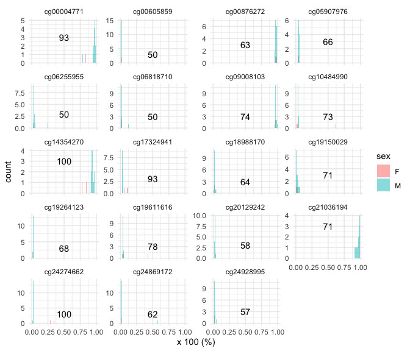

subset\_example
================

### Download the subseted epigenetics data

Available on the following GitHub repository
<https://github.com/abele41/Human-epigenetic-study/blob/master/dataset.RData>.

``` r
load('git_abele41_dataset.RData')

data_sub <- dataset[dataset$exp == 0, -c(2:4)]
fem_rowid <- c(1,3)
male_rowid <- c(2,4:17)
```

### Calculate Gap Statistic

``` r
stat <- function(a,b){
  i<-1
  
  d1<-quantile(a,probs=(100:0)/100,na.rm=TRUE)<quantile(b,probs=(0:100)/100,na.rm=TRUE) 
  d2<-quantile(a,probs=(0:100)/100,na.rm=TRUE)>quantile(b,probs=(100:0)/100,na.rm=TRUE)
  
  if(table(d1)[1]==101) return(100)
  if(table(d1)[1]<=table(d1)[2]) #female on the right
  { while(1*(d1[i])==0){i<-i+1}
    return(((100:0)/100)[i]*100)
  }
  if(table(d1)[1]>table(d1)[2]) #female on the left
  {  while(1*(d2[i])==0){i<-i+1}
    return(((100:0)/100)[i]*100)
  }
}

gap_stat_bob <- apply(data_sub[,2:20], 2, function(x) stat(x[fem_rowid], x[male_rowid])) 

gap_stat_bob
```

    ## cg09008103 cg19264123 cg14354270 cg00876272 cg24928995 cg18988170 cg06818710 
    ##         74         68        100         63         57         64         50 
    ## cg06255955 cg00004771 cg21036194 cg00605859 cg20129242 cg19150029 cg24274662 
    ##         50         93         71         50         58         71        100 
    ## cg10484990 cg05907976 cg17324941 cg24869172 cg19611616 
    ##         73         66         93         62         78

### Plot

``` r
library(ggplot2)
library(reshape2)
```

``` r
data_melt <- melt(data_sub[,2:20])

# add sex
sex_vec <- rep("M", 17)
sex_vec[fem_rowid] <- "F"
data_melt$sex <- rep(sex_vec,19)

gap_value_bob <- melt(gap_stat_bob)
gap_value_bob$variable <- rownames(gap_value_bob)

ggplot(data_melt, aes(x=value)) +
  geom_histogram(alpha=0.5, aes(fill=sex), bins = 100, position="identity") +
  facet_wrap(. ~ variable, nrow = 5, scales ="free_y") + xlab('x 100 (%)') +
  geom_text(data = gap_value_bob, mapping = aes(x = .5, y = 3, label = value)) + 
  theme_minimal() 
```

<!-- -->

### Randomization tests
