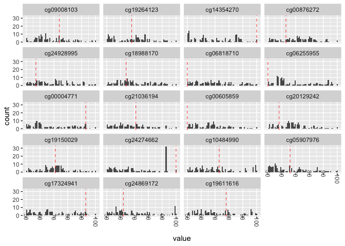

subset\_example
================

### Download the subseted epigenetics data

Available on the following GitHub repository
<https://github.com/abele41/Human-epigenetic-study/blob/master/dataset.RData>.

``` r
load('git_abele41_dataset.RData')

data_sub <- dataset[dataset$exp == 0, -c(2:4)]
fem_rowid <- c(1,3)
male_rowid <- c(2,4:17)
```

### Calculate Gap Statistic

``` r
stat <- function(a,b){
  i<-1
  
  d1<-quantile(a,probs=(100:0)/100,na.rm=TRUE)<quantile(b,probs=(0:100)/100,na.rm=TRUE) 
  d2<-quantile(a,probs=(0:100)/100,na.rm=TRUE)>quantile(b,probs=(100:0)/100,na.rm=TRUE)
  
  if(table(d1)[1]==101) return(100)
  if(table(d1)[1]<=table(d1)[2]) #female on the right
  { while(1*(d1[i])==0){i<-i+1}
    return(((100:0)/100)[i]*100)
  }
  if(table(d1)[1]>table(d1)[2]) #female on the left
  {  while(1*(d2[i])==0){i<-i+1}
    return(((100:0)/100)[i]*100)
  }
}

gap_stat_bob <- apply(data_sub[,2:20], 2, function(x) stat(x[fem_rowid], x[male_rowid])) 

gap_stat_bob
```

    ## cg09008103 cg19264123 cg14354270 cg00876272 cg24928995 cg18988170 cg06818710 
    ##         74         68        100         63         57         64         50 
    ## cg06255955 cg00004771 cg21036194 cg00605859 cg20129242 cg19150029 cg24274662 
    ##         50         93         71         50         58         71        100 
    ## cg10484990 cg05907976 cg17324941 cg24869172 cg19611616 
    ##         73         66         93         62         78

### Plot

``` r
library(ggplot2)
library(reshape2)
```

``` r
data_melt <- melt(data_sub[,2:20])

# add sex
sex_vec <- rep("M", 17)
sex_vec[fem_rowid] <- "F"
data_melt$sex <- rep(sex_vec,19)

gap_value_bob <- melt(gap_stat_bob)
gap_value_bob$variable <- rownames(gap_value_bob)

ggplot(data_melt, aes(x=value)) +
  geom_histogram(alpha=0.5, aes(fill=sex), bins = 100, position="identity") +
  facet_wrap(. ~ variable, nrow = 5, scales ="free_y") + xlab('x 100 (%)') +
  geom_text(data = gap_value_bob, mapping = aes(x = .5, y = 3, label = value)) + 
  theme_minimal() 
```

<!-- -->

## Randomization tests

``` r
## How many possible randomizations? 
choose(17,2)
```

    ## [1] 136

``` r
## fill a matrix will all the possible treatment assignments (W_sim)
# columns: nr. of units
# rows: nr. of randomizations/premutations
W_sim = matrix(NA, ncol=17, nrow=10^5)
for(t in 1:10^5){
  W_sim[t,] = sample(sex_vec) # permute the treatment assignement vector (CRD)
}

# head(W_sim)

## retrieve the unique W vectors (W_sim_unique)
W_sim_unique = unique(W_sim, MARGIN = 1)
dim(W_sim_unique)
```

    ## [1] 136  17

## Calculate separation stat. for all possible randomizations (null randomization distribution)

``` r
# set the number of randomizations
nrep <- dim(W_sim_unique)[1]

# create a matrix where the t_rand will be saved
t_arrays <- matrix(NA, ncol=length(gap_stat_bob), nrow=nrep)

for(i in 1:nrep){
  # print(i)
  W_rep = W_sim_unique[i,]
  # fill t_arrays 
  t_arrays[i,] = apply(data_sub[,2:20], 2, function(x) stat(x[W_rep == "F"],x[W_rep == "M"]))
}

t_arrays <- rbind(gap_stat_bob,t_arrays)

## calculate p_value
p_values <- apply(t_arrays, 2, function(x) mean(t_arrays >= t_arrays[1,]))

## melt t_arrays
t_arrays_data_frame <- data.frame(t_arrays)
colnames(t_arrays_data_frame) <- names(gap_stat_bob)

t_array_melt <- melt(t_arrays_data_frame)

dat_text_lab <- data.frame(variable = names(gap_stat_bob))
dat_text_lab$obs_stat <- as.numeric(gap_stat_bob)

ggplot(t_array_melt,aes(x = value)) + 
  facet_wrap(~variable, nrow = 5) + 
  geom_histogram(binwidth = 0.8) + 
  theme(axis.text.x = element_text(angle = -90, vjust = 0.5, hjust = -1)) +
  geom_vline(data = dat_text_lab, mapping = aes(xintercept = obs_stat), 
             linetype = "dashed", colour = "red", size = .3)
```

<!-- -->
